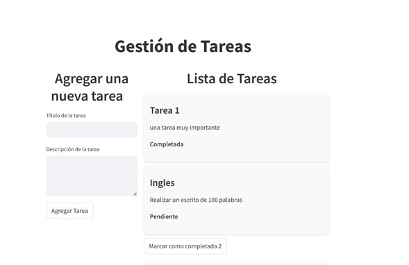
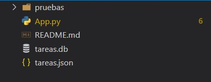
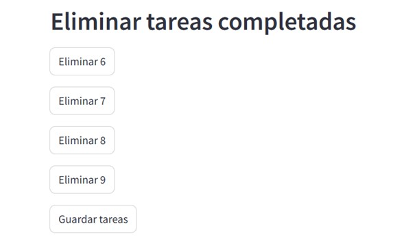
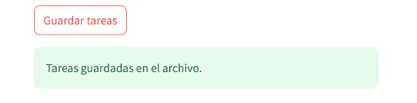

# Gestion de tareas

## Descripcion
Este es un proyecto que gestiona tareas por realizar, puedes agregar, eliminar o marcar como completada alguna tarea.
Maneja un archivo .json para guardar y/o eliminar las tareas, ademas cuenta con una persistencia SQLite.

##  Uso
1. Luego de descargar el repositorio, en el directorio del proyecto (TAREAS) ejecutas el siguiente comando:
    streamlit run App.py

##  Autor
Jhon Ederson Jaimes Torres

##  Imágenes aplicación funcionando

